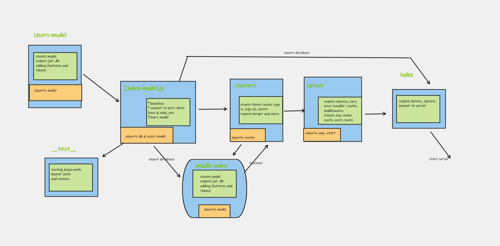

# bearer-auth
At this point, our auth-server is able to allow a user to create an account as well as to handle Basic Authentication (user provides a username + password). When a “good” login happens, the user is considered to be “authenticated” and our auth-server generates a JWT signed “Token” which is returned to the application  We will now be using that Token to re-authenticate users to shield access to any route that requires a valid login to access.

## UML diagram

## **here are the links for the server:**

**1. The Actions link:**
   [Actions](https://github.com/marah-jaradat/bearer-auth/actions)

**2. The Pull request:**
   [pull request](https://github.com/marah-jaradat/bearer-auth/pull/1)

**3. Heroku link**
    [deploy-main](https://auth-server-marah.herokuapp.com/)
